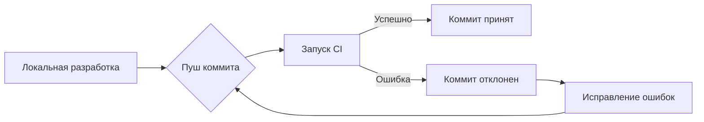

## Overview
Руководство по использованию CI файлов в проекте SLOS. Объясняет, зачем нужны файлы в `.github/workflows/`, как их проверить и как интегрировать в рабочий процесс для автоматической валидации артефактов. Включает практические примеры и рекомендации по устранению распространенных проблем.

## Detail
### 1. Зачем нужны CI файлы в SLOS
#### 🔍 Основное назначение
CI файлы (Continuous Integration) в директории `.github/workflows/` выполняют **автоматическую проверку** каждого коммита на соответствие стандартам SLOS. Это критически важно для артефактоцентричного подхода, так как:

- **Гарантируют целостность артефактов** — проверяют структуру, META-заголовки и соответствие YFM
- **Предотвращают ручные ошибки** — автоматически блокируют коммиты с некорректными артефактами
- **Создают обратную связь** — дают мгновенный фидбэк разработчикам через GitHub UI
- **Сохраняют историю проверок** — все проверки логируются и доступны для аудита

#### ✅ Примеры проверок в наших CI файлах
1. **parser-validation.yml**:
   - Проверяет, что артефакты соответствуют шаблону `--- ARTIFACT_START ---`
   - Запускает тесты парсера через pytest
   - Проверяет соответствие YFM (использование `:::` вместо ````)

2. **json-schema-validation.yml**:
   - Проверяет, что JSON Schema соответствует стандартам
   - Валидирует примеры схем в документации
   - Проверяет наличие всех обязательных полей

3. **readme-validation.yml**:
   - Проверяет структуру README.md
   - Убеждается, что все разделы присутствуют
   - Проверяет наличие consumer-facing документации

### 2. Как проверить, что CI файлы работают
#### 🔧 Локальная проверка CI
Перед пушем изменений вы можете проверить, что CI будет проходить успешно:

```bash
# 1. Установите act (инструмент для локального запуска GitHub Actions)
brew install nektos/tap/act  # Для macOS
# ИЛИ
curl https://raw.githubusercontent.com/nektos/act/master/install.sh | sudo bash  # Для Linux/WSL

# 2. Запустите локально все workflows
act push

# 3. Или запустите конкретный workflow
act "Parser Validation"
```

#### 🔧 Проверка через GitHub UI
1. Перейдите в репозиторий на GitHub
2. Откройте вкладку "Actions"
3. Выберите workflow (например, "Parser Validation")
4. Посмотрите статус выполнения (зеленый = успешно, красный = ошибка)

#### 🔧 Принудительный запуск CI
Если CI не запускается автоматически:
```bash
# Создаем пустой коммит для запуска CI
git commit --allow-empty -m "Trigger CI"
git push
```

### 3. Типичные проблемы и их решение
#### 🔥 Проблема: CI не запускается
**Причина**: 
- Файлы в `.github/workflows/` имеют неправильное имя или расширение
- Ошибки в синтаксисе YAML

**Решение**:
1. Убедитесь, что файлы имеют расширение `.yml`
2. Проверьте синтаксис YAML через онлайн-валидатор
3. Убедитесь, что файлы находятся в правильной директории: `.github/workflows/`

#### 🔥 Проблема: CI падает с ошибкой
**Причина**: 
- Тесты не проходят
- Ошибки в скриптах валидации

**Решение**:
1. Посмотрите логи CI в GitHub Actions
2. Запустите тесты локально: `./scripts/run-parser-tests.sh`
3. Исправьте ошибки и создайте новый коммит

### 4. Интеграция CI в рабочий процесс
#### ✅ Рабочий процесс с использованием CI


#### ✅ Best Practices для CI в SLOS
1. **Всегда проверяйте CI перед мерджем**:
   - Не мержите код, пока CI не проходит успешно
   - Используйте "Required checks" в GitHub branch protection

2. **Создавайте информативные сообщения об ошибках**:
   ```yaml
   - name: Validate YFM compliance
     run: |
       if grep -q "```" docs/**/*.md; then
         echo "❌ Найдены блоки с ```. Требуется использовать ::: для YFM"
         exit 1
       fi
   ```

3. **Используйте кэширование для ускорения CI**:
   ```yaml
   - name: Cache dependencies
     uses: actions/cache@v3
     with:
       path: ~/.cache/pip
       key: ${{ runner.os }}-pip-${{ hashFiles('**/requirements.txt') }}
   ```

## Examples
### Как проверить CI локально
```bash
# Установите act
brew install nektos/tap/act

# Запустите все workflows
act push

# Ожидаемый вывод:
# [Parser Validation/validate-parser] 🚀  Run Set up Python
# [Parser Validation/validate-parser] 🚀  Run Create and activate virtual environment
# [Parser Validation/validate-parser] 🚀  Run Install dependencies
# [Parser Validation/validate-parser] 🚀  Run Run parser tests
# ...
# [Parser Validation/validate-parser] ✅  Success - Run Run parser tests
```

### Как добавить защиту веток в GitHub
1. Перейдите в Settings репозитория
2. Выберите Branches
3. Нажмите "Add rule" для ветки master
4. Включите:
   - Require status checks to pass before merging
   - Выберите все необходимые проверки (Parser Validation, JSON Schema Validation и т.д.)
   - Включите "Require branches to be up to date before merging"

### Пример рабочего workflow для парсера
```yaml
name: Parser Validation
on: [push]
jobs:
  validate-parser:
    runs-on: ubuntu-latest
    steps:
      - uses: actions/checkout@v4
      
      - name: Set up Python
        uses: actions/setup-python@v4
        with:
          python-version: '3.11'
          
      - name: Create and activate virtual environment
        run: |
          python -m venv .venv
          source .venv/bin/activate
          
      - name: Install dependencies
        run: |
          pip install --upgrade pip
          pip install jsonschema pytest
      
      - name: Run parser tests
        run: |
          source .venv/bin/activate
          pytest tests/parser_test.py --verbose
          
      - name: Validate YFM compliance
        run: |
          # Проверка использования ::: вместо ```
          if grep -q "```" docs/**/*.md; then
            echo "❌ Найдены блоки с ```. Требуется использовать ::: для YFM"
            exit 1
          fi
          
          # Проверка формата META
          if grep -qE "---META:.*(\n|\r\n).*---" docs/**/*.md; then
            echo "❌ META должен быть в одной строке (YFM-требование)"
            exit 1
          fi
          
          echo "✅ Все файлы соответствуют YFM"
```

## Glossary
**CI Pipeline** — Последовательность шагов, выполняемых при каждом коммите для проверки кода.  
**GitHub Actions** — Система CI/CD, встроенная в GitHub для автоматизации рабочих процессов.  
**Branch Protection** — Защита веток в GitHub, требующая успешного прохождения CI перед мерджем.  
**Workflow** — Конфигурационный файл в `.github/workflows/`, определяющий CI процесс.

## Style Rules
- Все CI файлы → должны иметь расширение `.yml`
- Все проверки → должны давать понятные сообщения об ошибках
- Примеры кода → снабжены комментариями `<!-- WSL: ... -->`
- Нет свободного текста вне структуры артефакта

## PRP Trace
**Intent**: Объяснить назначение CI файлов и как их правильно использовать в проекте SLOS.  
**Actions**:  
1. Анализ назначения CI файлов в артефактоцентричном подходе  
2. Предоставление инструкций по локальной проверке CI  
3. Описание типичных проблем и их решений  
4. Создание примеров рабочих workflow  

**Constraints**:  
- Объяснение без внешних ссылок  
- Фокус на практическом применении  
- Статус `status=production` в META  

## Traceability
**Входные артефакты**:  
- [[Parser-Implementation_v19.2.5]]  
- [[WSL-Issues-Summary_v19.2.5]]  

**Выходные зависимости**:  
- Понимание haku назначения CI файлов  
- Возможность проверять CI локально перед пушем  

**Obsidian Backlinks**:  
[[CI-Usage-Guide_v19.2.5#Detail]] → [[Parser-Implementation_v19.2.5#Detail]]  
[[CI-Usage-Guide_v19.2.5#Examples]] → [[GitHub_Actions_Template_v1.0#Implementation]]
