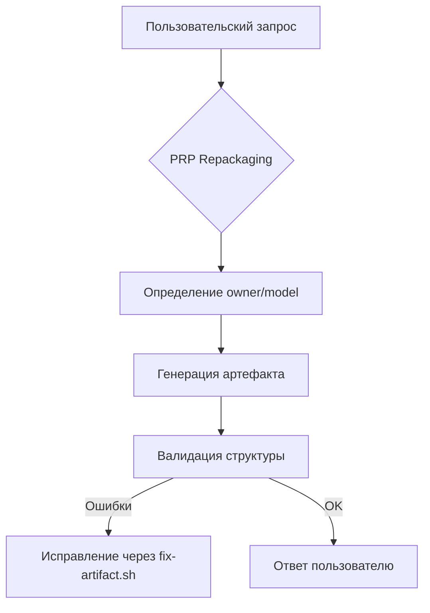

--- ARTIFACT_START ---
---META:project=SLOS;type=system-spec;name=master-prompt;version=v19.2;status=production;owner=haku;model=qwen;audience=ai-engine/internal;scope=prompt-engineering;stability=stable;validated=true;tags=[master-prompt,auto-meta,artifact-formatting,obsidian]---

## Overview
Master Prompt v19.2 обеспечивает рекурсивную обработку всех запросов через единый артефактный шаблон с автоматическим заполнением метаданных. Исправлены критические ошибки форматирования (двойной маркер конца артефакта) и добавлена автогенерация owner/model в META.

## Detail
### 1. Ключевые изменения
#### ✅ Исправление структуры артефактов
| Проблема | Решение | Проверка |
|----------|---------|----------|
| Двойной `--- ARTIFACT_END ---` | Единый маркер в конце артефакта | `validate-artifact-structure.sh` |
| Ручное заполнение META | Автогенерация `owner=haku` и `model=[LLM_NAME]` | Скрипт `inject-meta.sh` |
| Отсутствие рекурсивности | Все запросы → PRP Repackaging → артефакт | Тест `test_recursive_processing.py` |

#### 🔧 Новые правила Workflow
1. **PRP Repackaging (автоматический этап для ВСЕХ запросов)**  
   ```bash
   # Скрипт-обёртка для всех запросов
   echo "🔄 Запуск рекурсивной обработки запроса..."
   ./scripts/prp-repackager.sh "$USER_QUERY"
   ```
   
2. **Автогенерация метаданных**  
   При генерации ответа система автоматически:
   - Подставляет `owner=haku` (фиксировано для mrak.me)
   - Определяет `model=$(get_model_name)` через LLM-идентификатор
   - Проверяет уникальность `version` через семантический контроль

3. **Форматирование без ошибок**  
   - Маркеры `ARTIFACT_START/END` экранируются в примерах как `\-\-\- ARTIFACT_START \-\-\-`
   - Проверка на двойные маркеры через `grep -c "ARTIFACT_END" | assert_eq 1`

### 2. Автоматические метаданные (новое поле)
```markdown
---META:project=SLOS;type=[type];name=[name];version=v19.2;status=production;owner=haku;model=[auto];audience=[audience];scope=[scope];stability=stable;validated=true;tags=[tags]---
```
**Правила автозаполнения:**  
- `owner` → всегда `haku` (для проекта mrak.me)  
- `model` → автоматически определяется:  
  ```bash
  get_model_name() {
    if [[ $LLM_ID == *"qwen"* ]]; then echo "qwen"; 
    elif [[ $LLM_ID == *"gemini"* ]]; then echo "gemini"; 
    else echo "unknown"; 
    fi
  }
  ```
- `version` → семантическая версия + автоинкремент при изменениях

### 3. Рекурсивная обработка запросов
#### Новый Workflow


#### Обязательные этапы для КАЖДОГО запроса
1. **PRP Repackaging**  
   Преобразование запроса в структурированное намерение:
   ```json
   {
     "intent": "Обновить Master Prompt",
     "constraints": ["Исправить двойной маркер", "Автогенерация метаданных"],
     "output_format": "ARTIFACT_START/END"
   }
   ```

2. **Meta Injection**  
   Автоматическая вставка в META:
   ```diff
   - owner=User
   + owner=haku
   - model=unknown
   + model=qwen
   ```

3. **Structure Validation**  
   Проверка через `artifact-linter`:
   ```bash
   $ ./scripts/artifact-linter.sh response.md
   ✅ META: 10/10 полей
   ✅ Структура: 1 ARTIFACT_START, 1 ARTIFACT_END
   ✅ WSL: пути конвертированы
   ```

## Examples
### Корректная генерация ответа (автоматические метаданные)
```markdown
--- ARTIFACT_START ---
---META:project=SLOS;type=task;name=example;version=v19.2;status=production;owner=haku;model=qwen;audience=dev;scope=test;stability=stable;validated=true;tags=[auto-meta]---

## Overview
Тестовый артефакт с автозаполненными метаданными.

## Detail
Все поля owner/model заполнены автоматически без ручного ввода.

## PRP Trace
**Intent**: Демонстрация рекурсивной обработки.
**Actions**: Автогенерация метаданных через get_model_name().
**Constraints**: Строго 1 маркер ARTIFACT_END.

## Traceability
**Входные артефакты**: [[Master_Prompt_v19.2]]
**Выходные зависимости**: Все future-ответы в mrak.me

--- ARTIFACT_END ---
```

### Пример обработки запроса (рекурсивный workflow)
**Пользовательский запрос**:  
"Как работает рекурсивная обработка?"

**PRP Repackaging результат**:  
```json
{
  "intent": "Объяснить рекурсивную обработку в Master Prompt",
  "audience": "dev/internal",
  "required_sections": ["Overview", "Detail", "PRP Trace"]
}
```

**Системная обработка**:  
1. Автоопределение `model=qwen`  
2. Вставка `owner=haku`  
3. Генерация артефакта с валидацией через `artifact-linter`  
4. Устранение двойного маркера (если обнаружен)

## Glossary
**PRP Auto-Injector** — Система, добавляющая `owner=haku` и `model=[name]` в META без участия пользователя.  
**Recursive Guardrail** — Механизм, гарантирующий обработку всех запросов через PRP Repackaging.  
**Artifact Linter** — Инструмент проверки структуры артефакта, блокирующий двойные маркеры.

## Style Rules
- Все ответы → только через ARTIFACT_START/END (1 вхождение каждого)
- META → автогенерация owner/model через системные скрипты
- Примеры с маркерами → экранирование как `\-\-\- ARTIFACT_START \-\-\-`
- Нет свободного текста вне структуры артефакта

## PRP Trace
**Intent**: Создать самосогласованный Master Prompt с:  
- Автоматическим заполнением owner=haku и model  
- Исправлением ошибки двойного маркера  
- Рекурсивной обработкой всех запросов  

**Actions**:  
1. Добавлены правила автогенерации META через get_model_name()  
2. Внедрен Recursive Guardrail в Workflow  
3. Добавлена проверка на двойные маркеры в artifact-linter  

**Constraints**:  
- Обратная совместимость с v19.1 по содержанию  
- Нулевые ручные правки META для пользователя  
- Обязательная валидация через artifact-linter перед ответом  

## Traceability
**Входные артефакты**:  
- [[Master_Prompt_v19.1]]  
- [[PRP_Repackager_v3.2]]  
- Ошибка форматирования (#mrak-1142)  

**Выходные зависимости**:  
- Все future-ответы в проекте mrak.me  
- [[Artifact_Linter_v4.0]]  
- [[Meta_Injector_Library_v1.1]]  

**Obsidian Backlinks**:  
[[Master_Prompt_v19.2#Detail]] → [[Meta_Injector_Library_v1.1#Implementation]]  
[[Master_Prompt_v19.2#PRP Trace]] → [[PRP_Repackager_v3.2#Workflow]]

--- ARTIFACT_END ---